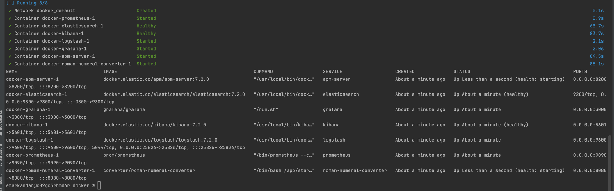
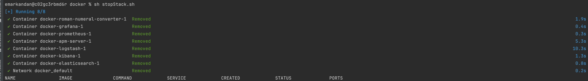

# roman-numeral-converter
This is a Spring Boot Java Application exposes a GET endpoint to convert the given integer to its corresponding Roman Numeral

Author : Elavarasi Markandan

## Development Tools
* spring-boot 3.3.1
* Java 21
* Maven
* Junit 5
* Mockito
* ElasticSearch
* Logstash
* Kibana
* Prometheus
* Grafana
* Docker

## Steps to Build and Run the stack without devops functionalities

1. Clone the git repo
`
git clone https://github.com/ElavarasiMarkandan/roman-numeral-converter.git
`
2. Run the `RomanNumeralConverterApplication` class

## Sample API Request/Responses

### Valid case
`
curl -X GET "http://localhost:8080/romannumeral?query=50" -H "accept: application/json"
`

### Success Response
```
Http Status Code: 200
{
  "input": "50",
  "output": "L"
}
```

### Invalid case 1
`
curl -X GET "http://localhost:8080/romannumeral?query=256" -H "accept: application/json"
`

### Error Response
```
Http Status Code: 400
{
  "statusCode": 400,
  "errorMessage": "Invalid input, out of range. Enter an integer value in the range from 1 to 255"
}
```
### Invalid case 2
`
curl -X GET "http://localhost:8080/romannumeral?query=xx" -H "accept: application/json"
`

### Error Response
```
Http Status Code: 400
{
  "statusCode": 400,
  "errorMessage": "Invalid input type, enter an integer value in the range from 1 to 255"
}
```

## Steps to Build and Run the stack with devops functionalities(ELK)
1. Clone the git repo
`
git clone https://github.com/ElavarasiMarkandan/roman-numeral-converter.git
`

2. Below tools/packages needs to be installed as a Pre-requisite to run the application
> java -version 
> 
> mvn -v
> 
> docker -v
> 
> docker-compose -v

3. All the necessary commands to run the application is available in startStack shell script.
   you can just run the shell script to start the application with Devops functionalities. 
   This script runs the mvn package and then uses docker compose to bring the new docker infrastructure.
   Your screen will look like this after 2 or 3 minutes , use refresh command until all the services shows as up and healthy




> cd docker
> 
> sh startStack.sh


To Refresh the service use below command
```
docker-compose -f docker-compose.yml ps
```

4. Verify if the ELK and Application services are up and running,

> APM Server - http://localhost:8200/
>
> Elasticsearch - http://localhost:9200/
>
> Grafana - http://localhost:3000/
> 
> Kibana - http://localhost:5601/
>
> logstash - http://localhost:9600/
> 
> Prometheus - http://localhost:9090/
>
> roman-numeral-converter Application - http://localhost:8080/actuator/health
>
> Application swagger - http://localhost:8080/swagger-ui.html

## Testing

Health Check

> http://localhost:8080/actuator/health

### Run Unit tests

From application root directory, run
> mvn clean install

```
Test Cases:

IntegerToRomanNumeralConverterControllerTest
- Happy Path case - testIntegerToRomanNumeralConverter_Success 
- Error case 1- input number less than min value < 1 - testIntegerToRomanNumeralConverter_InputOutOfRange_LessThanMinError
- Error case 2- input number greater than max value > 255 - testIntegerToRomanNumeralConverter_InputOutOfRange_GreaterThanMaxError
- Error case 3- input number data type is other than int - testIntegerToRomanNumeralConverter_InputInvalidType
- Error case 4- Mock RunTimeException - testIntegerToRomanNumeralConverter_internalServerError

IntegerToRomanNumeralConverterServiceImplTest
- Different valid input value assertions - testIntegerToRomanNumeralConversion_Success

```

### Run Acceptance tests

1. ATs can be integrated as one of the step into the CI/CD pipeline with test cases, which confirms application starts
   and run without any error and can be deployed to next stage
2. Use the below command, to run the acceptance tests,

> mvn test -Dtest=IntegerToRomanNumeralConverterAT

```
Acceptance Test Cases

IntegerToRomanNumeralConverterAT
- Validate content type is application/json - testContentTypeIsApplicationJson
- Happy Path case to convert valid int to its corresponding roman numeral- testRomanNumeralConversion_Success
- Error case 1, to validate out of range conversions. Valid range 1 to 255 - testRomanNumeralConversion_OutOfRange_Error
- Error case 2, to validate invalid data type, valid data type is int - testRomanNumeralConversion_InvalidDataType_Error
```

## How to un-install Stack?

To un-install the application, all the required commands are available in stopStack shell script, to stop the whole application stack
along with the devops capabilities, your screen will look like this once the stack is stopped all the devops functionalities are removed


```
cd docker
sh stopStack.sh
```
